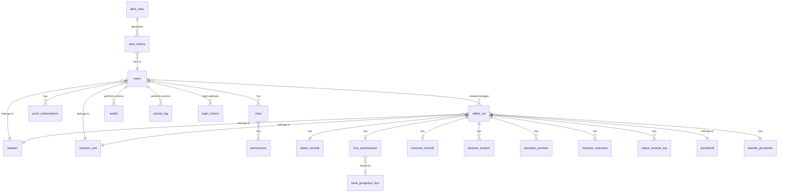
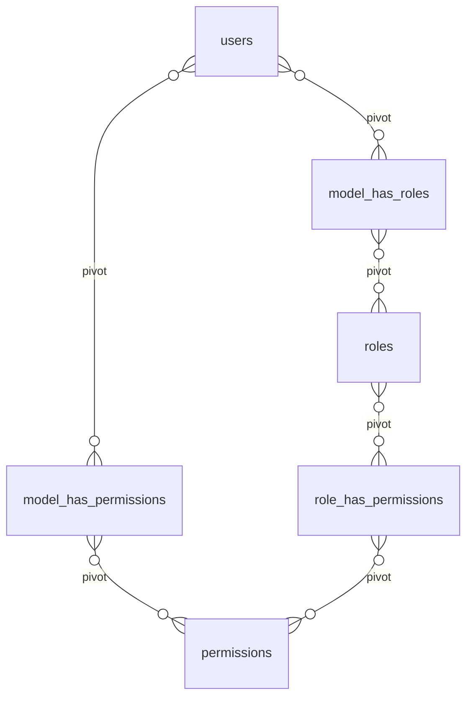

# Entity Relationship Diagram (ERD)
## Sistem Pengurusan Dokumen Kontrak & Bon Pelaksanaan

**Versi:** 1.0
**Tarikh:** 12 Mei 2026
**Jumlah Jadual:** 28 jadual utama

---

## Daftar Kandungan

1. [Gambaran Keseluruhan](#gambaran-keseluruhan)
2. [ERD Visual (Mermaid)](#erd-visual-mermaid)
3. [Kategori 1: Authentication & RBAC](#kategori-1-authentication--rbac)
4. [Kategori 2: Master Data](#kategori-2-master-data)
5. [Kategori 3: Core Transaction](#kategori-3-core-transaction)
6. [Kategori 4: Notification & Alert](#kategori-4-notification--alert)
7. [Kategori 5: Audit & Logging](#kategori-5-audit--logging)
8. [Indexes & Performance](#indexes--performance)
9. [Data Relationships](#data-relationships)

---

## Gambaran Keseluruhan

Pangkalan data MySQL 8.0 terdiri daripada **28 jadual utama** yang dibahagikan kepada 5 kategori:

| Kategori | Bilangan Jadual | Tujuan |
|---|---|---|
| **Authentication & RBAC** | 6 jadual | Pengguna, peranan, kebenaran (Spatie Permission) |
| **Master Data** | 7 jadual | Data rujukan, kod, pembekal |
| **Core Transaction** | 8 jadual | SST, kontrak, bon, penilaian |
| **Notification & Alert** | 4 jadual | Sistem notifikasi dan alert |
| **Audit & Logging** | 3 jadual | Log aktiviti dan audit trail |

**Prinsip Reka Bentuk:**
- Soft delete untuk semua jadual transaksi (`deleted_at`)
- Timestamp audit (`created_at`, `updated_at`)
- Foreign keys dengan ON DELETE constraints
- Indexes pada kolum yang kerap dicari
- Charset: `utf8mb4_unicode_ci` untuk sokongan Bahasa Malaysia

---

## ERD Visual (Mermaid)

### Core Entities & Relationships



### RBAC Structure (Spatie Permission)



---

## Kategori 1: Authentication & RBAC

### 1.1 Table: `users`

**Tujuan:** Pengguna sistem (semua peranan)

```sql
CREATE TABLE users (
    id                  BIGINT UNSIGNED AUTO_INCREMENT PRIMARY KEY,
    name                VARCHAR(200) NOT NULL,
    email               VARCHAR(120) NOT NULL UNIQUE,
    email_verified_at   TIMESTAMP NULL,
    password            VARCHAR(255) NOT NULL,
    no_kad_pengenalan   VARCHAR(12) NOT NULL UNIQUE,
    no_telefon          VARCHAR(20) NULL,
    jabatan_kod         VARCHAR(10) NULL,
    seksyen_unit_id     BIGINT UNSIGNED NULL,
    jawatan             VARCHAR(150) NULL,
    is_active           BOOLEAN DEFAULT TRUE,
    last_login_at       TIMESTAMP NULL,
    last_login_ip       VARCHAR(45) NULL,
    password_changed_at TIMESTAMP NULL,
    must_change_password BOOLEAN DEFAULT FALSE,
    two_factor_secret   TEXT NULL,
    two_factor_recovery_codes TEXT NULL,
    two_factor_confirmed_at TIMESTAMP NULL,
    remember_token      VARCHAR(100) NULL,
    created_at          TIMESTAMP DEFAULT CURRENT_TIMESTAMP,
    updated_at          TIMESTAMP DEFAULT CURRENT_TIMESTAMP ON UPDATE CURRENT_TIMESTAMP,
    deleted_at          TIMESTAMP NULL,

    INDEX idx_jabatan (jabatan_kod),
    INDEX idx_seksyen (seksyen_unit_id),
    INDEX idx_active (is_active),
    INDEX idx_email (email),
    INDEX idx_ic (no_kad_pengenalan),

    FOREIGN KEY (jabatan_kod) REFERENCES jabatan(kod_jabatan) ON DELETE SET NULL,
    FOREIGN KEY (seksyen_unit_id) REFERENCES seksyen_unit(id) ON DELETE SET NULL
) ENGINE=InnoDB DEFAULT CHARSET=utf8mb4 COLLATE=utf8mb4_unicode_ci;
```

### 1.2 Table: `roles`

**Tujuan:** Peranan sistem (7 peranan terbina dalam + tersuai)

```sql
CREATE TABLE roles (
    id          BIGINT UNSIGNED AUTO_INCREMENT PRIMARY KEY,
    name        VARCHAR(125) NOT NULL UNIQUE,
    guard_name  VARCHAR(125) NOT NULL DEFAULT 'web',
    description TEXT NULL,
    is_custom   BOOLEAN DEFAULT FALSE,
    created_at  TIMESTAMP DEFAULT CURRENT_TIMESTAMP,
    updated_at  TIMESTAMP DEFAULT CURRENT_TIMESTAMP ON UPDATE CURRENT_TIMESTAMP,

    UNIQUE KEY roles_name_guard_name_unique (name, guard_name)
) ENGINE=InnoDB DEFAULT CHARSET=utf8mb4 COLLATE=utf8mb4_unicode_ci;
```

**7 Peranan Terbina Dalam:**
- `super-admin` - Full system access
- `admin` - Pentadbir sistem
- `sk-exec` - Eksekutif (SK & TSK)
- `pengarah` - Pengarah Bahagian
- `ketua-unit` - Ketua Unit/Seksyen
- `pic` - Pegawai Perolehan
- `audit` - Pegawai Audit Dalam

### 1.3 Table: `permissions`

**Tujuan:** Kebenaran granular (modul.tindakan)

```sql
CREATE TABLE permissions (
    id          BIGINT UNSIGNED AUTO_INCREMENT PRIMARY KEY,
    name        VARCHAR(125) NOT NULL UNIQUE,
    guard_name  VARCHAR(125) NOT NULL DEFAULT 'web',
    description TEXT NULL,
    module      VARCHAR(50) NULL,
    created_at  TIMESTAMP DEFAULT CURRENT_TIMESTAMP,
    updated_at  TIMESTAMP DEFAULT CURRENT_TIMESTAMP ON UPDATE CURRENT_TIMESTAMP,

    UNIQUE KEY permissions_name_guard_name_unique (name, guard_name),
    INDEX idx_module (module)
) ENGINE=InnoDB DEFAULT CHARSET=utf8mb4 COLLATE=utf8mb4_unicode_ci;
```

**Format Permission:** `<modul>.<tindakan>`
- Contoh: `sst.create`, `kontrak.update`, `bon.delete`, `dashboard.view`, `laporan.export`

### 1.4 Table: `model_has_roles`

**Tujuan:** Pivot table pengguna ↔ peranan

```sql
CREATE TABLE model_has_roles (
    role_id     BIGINT UNSIGNED NOT NULL,
    model_type  VARCHAR(125) NOT NULL,
    model_id    BIGINT UNSIGNED NOT NULL,

    PRIMARY KEY (role_id, model_id, model_type),
    INDEX idx_model (model_id, model_type),

    FOREIGN KEY (role_id) REFERENCES roles(id) ON DELETE CASCADE
) ENGINE=InnoDB DEFAULT CHARSET=utf8mb4 COLLATE=utf8mb4_unicode_ci;
```

### 1.5 Table: `model_has_permissions`

**Tujuan:** Pivot table pengguna ↔ kebenaran langsung

```sql
CREATE TABLE model_has_permissions (
    permission_id BIGINT UNSIGNED NOT NULL,
    model_type    VARCHAR(125) NOT NULL,
    model_id      BIGINT UNSIGNED NOT NULL,

    PRIMARY KEY (permission_id, model_id, model_type),
    INDEX idx_model (model_id, model_type),

    FOREIGN KEY (permission_id) REFERENCES permissions(id) ON DELETE CASCADE
) ENGINE=InnoDB DEFAULT CHARSET=utf8mb4 COLLATE=utf8mb4_unicode_ci;
```

### 1.6 Table: `role_has_permissions`

**Tujuan:** Pivot table peranan ↔ kebenaran

```sql
CREATE TABLE role_has_permissions (
    permission_id BIGINT UNSIGNED NOT NULL,
    role_id       BIGINT UNSIGNED NOT NULL,

    PRIMARY KEY (permission_id, role_id),

    FOREIGN KEY (permission_id) REFERENCES permissions(id) ON DELETE CASCADE,
    FOREIGN KEY (role_id) REFERENCES roles(id) ON DELETE CASCADE
) ENGINE=InnoDB DEFAULT CHARSET=utf8mb4 COLLATE=utf8mb4_unicode_ci;
```

---

## Kategori 2: Master Data

### 2.1 Table: `jabatan`

**Tujuan:** Senarai jabatan SUK Kedah

```sql
CREATE TABLE jabatan (
    kod_jabatan     VARCHAR(10) PRIMARY KEY,
    nama_jabatan    VARCHAR(200) NOT NULL,
    singkatan       VARCHAR(20) NULL,
    pengarah_nama   VARCHAR(200) NULL,
    is_active       BOOLEAN DEFAULT TRUE,
    created_at      TIMESTAMP DEFAULT CURRENT_TIMESTAMP,
    updated_at      TIMESTAMP DEFAULT CURRENT_TIMESTAMP ON UPDATE CURRENT_TIMESTAMP,

    INDEX idx_active (is_active)
) ENGINE=InnoDB DEFAULT CHARSET=utf8mb4 COLLATE=utf8mb4_unicode_ci;
```

### 2.2 Table: `seksyen_unit`

**Tujuan:** Seksyen/unit dalam jabatan

```sql
CREATE TABLE seksyen_unit (
    id              BIGINT UNSIGNED AUTO_INCREMENT PRIMARY KEY,
    kod_seksyen     VARCHAR(20) NOT NULL UNIQUE,
    nama_seksyen    VARCHAR(200) NOT NULL,
    jabatan_kod     VARCHAR(10) NOT NULL,
    ketua_nama      VARCHAR(200) NULL,
    is_active       BOOLEAN DEFAULT TRUE,
    created_at      TIMESTAMP DEFAULT CURRENT_TIMESTAMP,
    updated_at      TIMESTAMP DEFAULT CURRENT_TIMESTAMP ON UPDATE CURRENT_TIMESTAMP,

    INDEX idx_jabatan (jabatan_kod),
    INDEX idx_active (is_active),

    FOREIGN KEY (jabatan_kod) REFERENCES jabatan(kod_jabatan) ON DELETE CASCADE
) ENGINE=InnoDB DEFAULT CHARSET=utf8mb4 COLLATE=utf8mb4_unicode_ci;
```

### 2.3 Table: `pembekal`

**Tujuan:** Cache pembekal dari API iDaftar

```sql
CREATE TABLE pembekal (
    no_pendaftaran      VARCHAR(50) PRIMARY KEY,
    nama_syarikat       VARCHAR(300) NOT NULL,
    kategori            VARCHAR(100) NULL,
    status_pendaftaran  VARCHAR(50) NULL,
    alamat              TEXT NULL,
    bandar              VARCHAR(100) NULL,
    negeri              VARCHAR(50) NULL,
    poskod              VARCHAR(10) NULL,
    no_telefon          VARCHAR(20) NULL,
    email               VARCHAR(120) NULL,
    status_mof          VARCHAR(50) NULL COMMENT 'Status MOF (active/suspended)',
    cached_at           TIMESTAMP NULL COMMENT 'Last API fetch timestamp',
    created_at          TIMESTAMP DEFAULT CURRENT_TIMESTAMP,
    updated_at          TIMESTAMP DEFAULT CURRENT_TIMESTAMP ON UPDATE CURRENT_TIMESTAMP,

    INDEX idx_nama (nama_syarikat(100)),
    INDEX idx_cached (cached_at)
) ENGINE=InnoDB DEFAULT CHARSET=utf8mb4 COLLATE=utf8mb4_unicode_ci;
```

### 2.4 Table: `kaedah_perolehan`

**Tujuan:** Jenis kaedah perolehan

```sql
CREATE TABLE kaedah_perolehan (
    id              BIGINT UNSIGNED AUTO_INCREMENT PRIMARY KEY,
    kod             VARCHAR(20) NOT NULL UNIQUE,
    nama            VARCHAR(100) NOT NULL,
    keterangan      TEXT NULL,
    had_nilai_min   DECIMAL(15,2) NULL,
    had_nilai_max   DECIMAL(15,2) NULL,
    is_active       BOOLEAN DEFAULT TRUE,
    created_at      TIMESTAMP DEFAULT CURRENT_TIMESTAMP,
    updated_at      TIMESTAMP DEFAULT CURRENT_TIMESTAMP ON UPDATE CURRENT_TIMESTAMP
) ENGINE=InnoDB DEFAULT CHARSET=utf8mb4 COLLATE=utf8mb4_unicode_ci;
```

**Data Awal:**
- Pembelian Terus
- Lantikan Terus
- Tender
- Sebut Harga
- Rundingan Terus

### 2.5 Table: `kategori_skop`

**Tujuan:** Bekalan / Perkhidmatan / Kerja

```sql
CREATE TABLE kategori_skop (
    id          BIGINT UNSIGNED AUTO_INCREMENT PRIMARY KEY,
    kod         VARCHAR(20) NOT NULL UNIQUE,
    nama        VARCHAR(100) NOT NULL,
    keterangan  TEXT NULL,
    is_active   BOOLEAN DEFAULT TRUE,
    created_at  TIMESTAMP DEFAULT CURRENT_TIMESTAMP,
    updated_at  TIMESTAMP DEFAULT CURRENT_TIMESTAMP ON UPDATE CURRENT_TIMESTAMP
) ENGINE=InnoDB DEFAULT CHARSET=utf8mb4 COLLATE=utf8mb4_unicode_ci;
```

**Data Awal:**
- `bekalan` - Bekalan
- `perkhidmatan` - Perkhidmatan
- `kerja` - Kerja

### 2.6 Table: `status_kontrak`

**Tujuan:** Senarai status kontrak

```sql
CREATE TABLE status_kontrak (
    id          BIGINT UNSIGNED AUTO_INCREMENT PRIMARY KEY,
    kod         VARCHAR(30) NOT NULL UNIQUE,
    nama        VARCHAR(100) NOT NULL,
    keterangan  TEXT NULL,
    warna       VARCHAR(20) NULL COMMENT 'Color code for UI',
    urutan      INT NULL COMMENT 'Display order',
    is_active   BOOLEAN DEFAULT TRUE,
    created_at  TIMESTAMP DEFAULT CURRENT_TIMESTAMP,
    updated_at  TIMESTAMP DEFAULT CURRENT_TIMESTAMP ON UPDATE CURRENT_TIMESTAMP
) ENGINE=InnoDB DEFAULT CHARSET=utf8mb4 COLLATE=utf8mb4_unicode_ci;
```

**Data Awal:**
- `aktif` - Aktif
- `siap` - Siap Sempurna
- `tamat` - Tamat
- `lanjutan` - Dalam Lanjutan
- `dibatalkan` - Dibatalkan

### 2.7 Table: `bank_pengeluar_bon`

**Tujuan:** Senarai bank pengeluar bon jaminan

```sql
CREATE TABLE bank_pengeluar_bon (
    id              BIGINT UNSIGNED AUTO_INCREMENT PRIMARY KEY,
    kod_bank        VARCHAR(20) NOT NULL UNIQUE,
    nama_bank       VARCHAR(200) NOT NULL,
    singkatan       VARCHAR(50) NULL,
    alamat          TEXT NULL,
    no_telefon      VARCHAR(20) NULL,
    email           VARCHAR(120) NULL,
    is_active       BOOLEAN DEFAULT TRUE,
    created_at      TIMESTAMP DEFAULT CURRENT_TIMESTAMP,
    updated_at      TIMESTAMP DEFAULT CURRENT_TIMESTAMP ON UPDATE CURRENT_TIMESTAMP,

    INDEX idx_active (is_active)
) ENGINE=InnoDB DEFAULT CHARSET=utf8mb4 COLLATE=utf8mb4_unicode_ci;
```

---

## Kategori 3: Core Transaction

### 3.1 Table: `daftar_sst` ⭐

**Tujuan:** Jadual utama - Surat Setuju Terima (SST)

```sql
CREATE TABLE daftar_sst (
    id                      BIGINT UNSIGNED AUTO_INCREMENT PRIMARY KEY,
    no_rujukan_sst          VARCHAR(50) NOT NULL UNIQUE,
    tarikh_sst              DATE NOT NULL,

    -- Jabatan & PIC
    jabatan_kod             VARCHAR(10) NOT NULL,
    seksyen_unit_id         BIGINT UNSIGNED NOT NULL,
    pic_id                  BIGINT UNSIGNED NOT NULL,

    -- Maklumat Pembekal
    pembekal_no_daftar      VARCHAR(50) NOT NULL,
    pembekal_pic_nama       VARCHAR(200) NULL,
    pembekal_pic_telefon    VARCHAR(20) NULL,
    pembekal_pic_emel       VARCHAR(120) NULL,

    -- Maklumat Perolehan
    skop                    ENUM('bekalan', 'perkhidmatan', 'kerja') NOT NULL,
    kaedah_perolehan_id     BIGINT UNSIGNED NOT NULL,
    tajuk_perjanjian        VARCHAR(500) NOT NULL,
    no_perolehan            VARCHAR(50) NULL,
    no_lo                   VARCHAR(50) NULL,
    tarikh_lo               DATE NULL,
    no_invois               VARCHAR(50) NULL,

    -- Nilai & Tempoh
    nilai_kontrak           DECIMAL(15,2) NOT NULL,
    tempoh_kontrak_bulan    TINYINT UNSIGNED NULL,
    tarikh_mula             DATE NOT NULL,
    tarikh_tamat            DATE NOT NULL,
    tarikh_lanjutan_1       DATE NULL,
    tarikh_lanjutan_2       DATE NULL,

    -- Status & Kategori
    kontrak_formal          BOOLEAN DEFAULT TRUE COMMENT 'Ya jika tempoh > 4 bulan',
    kategori_risiko         ENUM('normal', 'kategori_1', 'kategori_2') DEFAULT 'normal',
    status                  ENUM('aktif', 'siap', 'tamat', 'lanjutan', 'dibatalkan') DEFAULT 'aktif',

    -- Maklumat Tambahan
    penalti_klausa          TEXT NULL,
    pegawai_tandatangan     VARCHAR(200) NULL,
    tarikh_tandatangan_surat DATE NULL,
    catatan                 TEXT NULL,

    -- Audit Fields
    created_by              BIGINT UNSIGNED NOT NULL,
    updated_by              BIGINT UNSIGNED NULL,
    created_at              TIMESTAMP DEFAULT CURRENT_TIMESTAMP,
    updated_at              TIMESTAMP DEFAULT CURRENT_TIMESTAMP ON UPDATE CURRENT_TIMESTAMP,
    deleted_at              TIMESTAMP NULL,

    -- Indexes
    INDEX idx_no_rujukan (no_rujukan_sst),
    INDEX idx_jabatan (jabatan_kod),
    INDEX idx_seksyen (seksyen_unit_id),
    INDEX idx_pic (pic_id),
    INDEX idx_pembekal (pembekal_no_daftar),
    INDEX idx_status (status, kategori_risiko),
    INDEX idx_tarikh (tarikh_sst, tarikh_tamat),
    INDEX idx_nilai (nilai_kontrak),
    INDEX idx_kategori_risiko (kategori_risiko),
    INDEX idx_deleted (deleted_at),

    -- Foreign Keys
    FOREIGN KEY (jabatan_kod) REFERENCES jabatan(kod_jabatan) ON DELETE RESTRICT,
    FOREIGN KEY (seksyen_unit_id) REFERENCES seksyen_unit(id) ON DELETE RESTRICT,
    FOREIGN KEY (pic_id) REFERENCES users(id) ON DELETE RESTRICT,
    FOREIGN KEY (pembekal_no_daftar) REFERENCES pembekal(no_pendaftaran) ON DELETE RESTRICT,
    FOREIGN KEY (kaedah_perolehan_id) REFERENCES kaedah_perolehan(id) ON DELETE RESTRICT,
    FOREIGN KEY (created_by) REFERENCES users(id) ON DELETE RESTRICT,
    FOREIGN KEY (updated_by) REFERENCES users(id) ON DELETE SET NULL
) ENGINE=InnoDB DEFAULT CHARSET=utf8mb4 COLLATE=utf8mb4_unicode_ci;
```

### 3.2 Table: `daftar_kontrak`

**Tujuan:** Penjejakan dokumen kontrak formal (draft → PUU → tandatangan → stamping)

```sql
CREATE TABLE daftar_kontrak (
    id                          BIGINT UNSIGNED AUTO_INCREMENT PRIMARY KEY,
    daftar_sst_id               BIGINT UNSIGNED NOT NULL UNIQUE,

    -- Maklumat Kontrak
    nama_kontrak                VARCHAR(500) NOT NULL,
    tarikh_mula_perjanjian      DATE NOT NULL,
    tarikh_tamat_perjanjian     DATE NOT NULL,
    tempoh_kontrak_bulan        TINYINT UNSIGNED NULL,

    -- Tracking Workflow
    tarikh_deraf_ke_puu         DATE NULL,
    tarikh_deraf_ke_kontraktor  DATE NULL,
    tarikh_terima_dari_puu      DATE NULL,
    tarikh_tandatangan_kontrak  DATE NULL,
    tarikh_stamping             DATE NULL,

    -- Status
    status_semasa               VARCHAR(50) NULL COMMENT 'deraf/puu/tandatangan/stamping/siap',
    is_siap                     BOOLEAN DEFAULT FALSE COMMENT 'TRUE apabila stamping selesai',

    -- Kategori Risiko (Auto-calculated)
    is_kategori_1               BOOLEAN DEFAULT FALSE,
    is_kategori_2               BOOLEAN DEFAULT FALSE,

    -- Catatan
    catatan_dalaman             TEXT NULL,

    -- Audit Fields
    created_by                  BIGINT UNSIGNED NOT NULL,
    updated_by                  BIGINT UNSIGNED NULL,
    created_at                  TIMESTAMP DEFAULT CURRENT_TIMESTAMP,
    updated_at                  TIMESTAMP DEFAULT CURRENT_TIMESTAMP ON UPDATE CURRENT_TIMESTAMP,
    deleted_at                  TIMESTAMP NULL,

    -- Indexes
    INDEX idx_sst (daftar_sst_id),
    INDEX idx_status (status_semasa),
    INDEX idx_kategori (is_kategori_1, is_kategori_2),
    INDEX idx_siap (is_siap),
    INDEX idx_tarikh_deraf (tarikh_deraf_ke_puu),
    INDEX idx_tarikh_stamping (tarikh_stamping),

    -- Foreign Keys
    FOREIGN KEY (daftar_sst_id) REFERENCES daftar_sst(id) ON DELETE CASCADE,
    FOREIGN KEY (created_by) REFERENCES users(id) ON DELETE RESTRICT,
    FOREIGN KEY (updated_by) REFERENCES users(id) ON DELETE SET NULL
) ENGINE=InnoDB DEFAULT CHARSET=utf8mb4 COLLATE=utf8mb4_unicode_ci;
```

### 3.3 Table: `bon_pelaksanaan`

**Tujuan:** Bon pelaksanaan / jaminan bank

```sql
CREATE TABLE bon_pelaksanaan (
    id                      BIGINT UNSIGNED AUTO_INCREMENT PRIMARY KEY,
    daftar_sst_id           BIGINT UNSIGNED NOT NULL UNIQUE,

    -- Maklumat Bon
    no_rujukan_bon          VARCHAR(100) NOT NULL,
    jenis_bon               ENUM('jaminan_bank', 'insurans') NOT NULL DEFAULT 'jaminan_bank',
    nilai_bon               DECIMAL(15,2) NOT NULL,

    -- Pengeluar
    bank_pengeluar_id       BIGINT UNSIGNED NULL,
    pengeluar_nama          VARCHAR(200) NULL COMMENT 'Nama bank/syarikat insurans',

    -- Tempoh
    tarikh_mula_bon         DATE NOT NULL,
    tarikh_tamat_bon        DATE NOT NULL,

    -- Status
    status_bon              ENUM('aktif', 'akan_tamat', 'tamat', 'serah_balik', 'dalam_simpanan') DEFAULT 'aktif',
    tarikh_serah_balik      DATE NULL,
    diserah_kepada          VARCHAR(200) NULL,

    -- Alert Tracking
    alert_180_sent          BOOLEAN DEFAULT FALSE,
    alert_90_sent           BOOLEAN DEFAULT FALSE,
    alert_30_sent           BOOLEAN DEFAULT FALSE,
    alert_7_sent            BOOLEAN DEFAULT FALSE,

    -- Validation Flag
    is_tarikh_valid         BOOLEAN DEFAULT TRUE COMMENT 'FALSE jika tarikh tamat bon < tarikh tamat kontrak',

    -- Catatan
    catatan                 TEXT NULL,

    -- Audit Fields
    created_by              BIGINT UNSIGNED NOT NULL,
    updated_by              BIGINT UNSIGNED NULL,
    created_at              TIMESTAMP DEFAULT CURRENT_TIMESTAMP,
    updated_at              TIMESTAMP DEFAULT CURRENT_TIMESTAMP ON UPDATE CURRENT_TIMESTAMP,
    deleted_at              TIMESTAMP NULL,

    -- Indexes
    INDEX idx_sst (daftar_sst_id),
    INDEX idx_status (status_bon),
    INDEX idx_tarikh_tamat (tarikh_tamat_bon),
    INDEX idx_jenis (jenis_bon),
    INDEX idx_bank (bank_pengeluar_id),
    INDEX idx_akan_tamat (status_bon, tarikh_tamat_bon),

    -- Foreign Keys
    FOREIGN KEY (daftar_sst_id) REFERENCES daftar_sst(id) ON DELETE CASCADE,
    FOREIGN KEY (bank_pengeluar_id) REFERENCES bank_pengeluar_bon(id) ON DELETE SET NULL,
    FOREIGN KEY (created_by) REFERENCES users(id) ON DELETE RESTRICT,
    FOREIGN KEY (updated_by) REFERENCES users(id) ON DELETE SET NULL
) ENGINE=InnoDB DEFAULT CHARSET=utf8mb4 COLLATE=utf8mb4_unicode_ci;
```

### 3.4 Table: `insurans_kontrak`

**Tujuan:** Insurans (alternatif kepada bon pelaksanaan)

```sql
CREATE TABLE insurans_kontrak (
    id                      BIGINT UNSIGNED AUTO_INCREMENT PRIMARY KEY,
    daftar_sst_id           BIGINT UNSIGNED NOT NULL UNIQUE,

    -- Maklumat Insurans
    no_polisi               VARCHAR(100) NOT NULL,
    nilai_insurans          DECIMAL(15,2) NOT NULL,
    pengeluar_insurans      VARCHAR(200) NOT NULL,

    -- Tempoh
    tarikh_dari             DATE NOT NULL,
    tarikh_hingga           DATE NOT NULL,

    -- Status
    status                  ENUM('aktif', 'tamat', 'diperbaharui') DEFAULT 'aktif',

    -- Catatan
    catatan                 TEXT NULL,

    -- Audit Fields
    created_by              BIGINT UNSIGNED NOT NULL,
    updated_by              BIGINT UNSIGNED NULL,
    created_at              TIMESTAMP DEFAULT CURRENT_TIMESTAMP,
    updated_at              TIMESTAMP DEFAULT CURRENT_TIMESTAMP ON UPDATE CURRENT_TIMESTAMP,
    deleted_at              TIMESTAMP NULL,

    -- Indexes
    INDEX idx_sst (daftar_sst_id),
    INDEX idx_status (status),
    INDEX idx_tarikh (tarikh_dari, tarikh_hingga),

    -- Foreign Keys
    FOREIGN KEY (daftar_sst_id) REFERENCES daftar_sst(id) ON DELETE CASCADE,
    FOREIGN KEY (created_by) REFERENCES users(id) ON DELETE RESTRICT,
    FOREIGN KEY (updated_by) REFERENCES users(id) ON DELETE SET NULL
) ENGINE=InnoDB DEFAULT CHARSET=utf8mb4 COLLATE=utf8mb4_unicode_ci;
```

### 3.5 Table: `lanjutan_tempoh`

**Tujuan:** Rekod lanjutan kontrak

```sql
CREATE TABLE lanjutan_tempoh (
    id                      BIGINT UNSIGNED AUTO_INCREMENT PRIMARY KEY,
    daftar_sst_id           BIGINT UNSIGNED NOT NULL,

    -- Maklumat Lanjutan
    no_lanjutan             TINYINT UNSIGNED NOT NULL COMMENT '1 atau 2',
    tarikh_lanjutan_baharu  DATE NOT NULL,
    tempoh_tambahan_bulan   TINYINT UNSIGNED NOT NULL,

    -- Justifikasi
    sebab_lanjutan          TEXT NOT NULL,
    no_surat_lanjutan       VARCHAR(50) NULL,
    tarikh_surat            DATE NULL,

    -- Kelulusan
    diluluskan_oleh         VARCHAR(200) NULL,
    tarikh_kelulusan        DATE NULL,

    -- Audit Fields
    created_by              BIGINT UNSIGNED NOT NULL,
    updated_by              BIGINT UNSIGNED NULL,
    created_at              TIMESTAMP DEFAULT CURRENT_TIMESTAMP,
    updated_at              TIMESTAMP DEFAULT CURRENT_TIMESTAMP ON UPDATE CURRENT_TIMESTAMP,
    deleted_at              TIMESTAMP NULL,

    -- Indexes
    INDEX idx_sst (daftar_sst_id),
    INDEX idx_no_lanjutan (no_lanjutan),
    INDEX idx_tarikh_lanjutan (tarikh_lanjutan_baharu),

    -- Foreign Keys
    FOREIGN KEY (daftar_sst_id) REFERENCES daftar_sst(id) ON DELETE CASCADE,
    FOREIGN KEY (created_by) REFERENCES users(id) ON DELETE RESTRICT,
    FOREIGN KEY (updated_by) REFERENCES users(id) ON DELETE SET NULL,

    -- Constraint
    UNIQUE KEY unique_sst_no_lanjutan (daftar_sst_id, no_lanjutan)
) ENGINE=InnoDB DEFAULT CHARSET=utf8mb4 COLLATE=utf8mb4_unicode_ci;
```

### 3.6 Table: `penilaian_prestasi`

**Tujuan:** Penilaian prestasi pembekal (Laporan Bulanan Bahagian B)

```sql
CREATE TABLE penilaian_prestasi (
    id                      BIGINT UNSIGNED AUTO_INCREMENT PRIMARY KEY,
    daftar_sst_id           BIGINT UNSIGNED NOT NULL,

    -- Tempoh Penilaian
    bulan_penilaian         TINYINT UNSIGNED NOT NULL COMMENT '1-12',
    tahun_penilaian         YEAR NOT NULL,

    -- Skor Kriteria (0-100)
    skor_kualiti            DECIMAL(5,2) NULL,
    skor_masa               DECIMAL(5,2) NULL,
    skor_kos                DECIMAL(5,2) NULL,
    skor_keselamatan        DECIMAL(5,2) NULL,
    skor_perkhidmatan       DECIMAL(5,2) NULL,

    -- Skor Keseluruhan
    skor_purata             DECIMAL(5,2) NULL COMMENT 'Auto-calculated average',
    gred                    VARCHAR(2) NULL COMMENT 'A/B/C/D/E',

    -- Ulasan
    ulasan_pic              TEXT NULL,
    cadangan_penambahbaikan TEXT NULL,

    -- Kelulusan
    status_penilaian        ENUM('deraf', 'hantar', 'lulus', 'tolak') DEFAULT 'deraf',
    diluluskan_oleh         BIGINT UNSIGNED NULL COMMENT 'Ketua Unit ID',
    tarikh_kelulusan        DATE NULL,
    ulasan_ketua            TEXT NULL,

    -- PDF Generation
    pdf_path                VARCHAR(500) NULL,
    pdf_generated_at        TIMESTAMP NULL,

    -- Audit Fields
    created_by              BIGINT UNSIGNED NOT NULL,
    updated_by              BIGINT UNSIGNED NULL,
    created_at              TIMESTAMP DEFAULT CURRENT_TIMESTAMP,
    updated_at              TIMESTAMP DEFAULT CURRENT_TIMESTAMP ON UPDATE CURRENT_TIMESTAMP,
    deleted_at              TIMESTAMP NULL,

    -- Indexes
    INDEX idx_sst (daftar_sst_id),
    INDEX idx_tempoh (tahun_penilaian, bulan_penilaian),
    INDEX idx_status (status_penilaian),
    INDEX idx_skor (skor_purata),
    INDEX idx_diluluskan (diluluskan_oleh),

    -- Foreign Keys
    FOREIGN KEY (daftar_sst_id) REFERENCES daftar_sst(id) ON DELETE CASCADE,
    FOREIGN KEY (created_by) REFERENCES users(id) ON DELETE RESTRICT,
    FOREIGN KEY (updated_by) REFERENCES users(id) ON DELETE SET NULL,
    FOREIGN KEY (diluluskan_oleh) REFERENCES users(id) ON DELETE SET NULL,

    -- Constraint
    UNIQUE KEY unique_sst_bulan_tahun (daftar_sst_id, bulan_penilaian, tahun_penilaian)
) ENGINE=InnoDB DEFAULT CHARSET=utf8mb4 COLLATE=utf8mb4_unicode_ci;
```

### 3.7 Table: `lampiran_dokumen`

**Tujuan:** Fail lampiran (PDF, gambar) untuk SST/Kontrak

```sql
CREATE TABLE lampiran_dokumen (
    id                      BIGINT UNSIGNED AUTO_INCREMENT PRIMARY KEY,
    daftar_sst_id           BIGINT UNSIGNED NOT NULL,

    -- Maklumat Fail
    jenis_dokumen           VARCHAR(50) NOT NULL COMMENT 'sst/kontrak/bon/penilaian/lain',
    nama_fail               VARCHAR(300) NOT NULL,
    nama_fail_asal          VARCHAR(300) NOT NULL,
    path_fail               VARCHAR(500) NOT NULL,
    mime_type               VARCHAR(100) NOT NULL,
    saiz_fail               BIGINT UNSIGNED NOT NULL COMMENT 'Bytes',

    -- Metadata
    keterangan              TEXT NULL,

    -- Audit Fields
    uploaded_by             BIGINT UNSIGNED NOT NULL,
    created_at              TIMESTAMP DEFAULT CURRENT_TIMESTAMP,
    updated_at              TIMESTAMP DEFAULT CURRENT_TIMESTAMP ON UPDATE CURRENT_TIMESTAMP,
    deleted_at              TIMESTAMP NULL,

    -- Indexes
    INDEX idx_sst (daftar_sst_id),
    INDEX idx_jenis (jenis_dokumen),
    INDEX idx_uploaded_by (uploaded_by),

    -- Foreign Keys
    FOREIGN KEY (daftar_sst_id) REFERENCES daftar_sst(id) ON DELETE CASCADE,
    FOREIGN KEY (uploaded_by) REFERENCES users(id) ON DELETE RESTRICT
) ENGINE=InnoDB DEFAULT CHARSET=utf8mb4 COLLATE=utf8mb4_unicode_ci;
```

### 3.8 Table: `status_kontrak_log`

**Tujuan:** Log perubahan status kontrak (tracking flow)

```sql
CREATE TABLE status_kontrak_log (
    id                      BIGINT UNSIGNED AUTO_INCREMENT PRIMARY KEY,
    daftar_sst_id           BIGINT UNSIGNED NOT NULL,

    -- Status Change
    status_lama             VARCHAR(50) NULL,
    status_baharu           VARCHAR(50) NOT NULL,
    tarikh_status           DATE NOT NULL,

    -- Catatan
    catatan                 TEXT NULL,

    -- Audit Fields
    created_by              BIGINT UNSIGNED NOT NULL,
    created_at              TIMESTAMP DEFAULT CURRENT_TIMESTAMP,

    -- Indexes
    INDEX idx_sst (daftar_sst_id),
    INDEX idx_tarikh (tarikh_status),
    INDEX idx_status (status_baharu),

    -- Foreign Keys
    FOREIGN KEY (daftar_sst_id) REFERENCES daftar_sst(id) ON DELETE CASCADE,
    FOREIGN KEY (created_by) REFERENCES users(id) ON DELETE RESTRICT
) ENGINE=InnoDB DEFAULT CHARSET=utf8mb4 COLLATE=utf8mb4_unicode_ci;
```

---

## Kategori 4: Notification & Alert

### 4.1 Table: `notifications`

**Tujuan:** Laravel notification table (in-app)

```sql
CREATE TABLE notifications (
    id              CHAR(36) PRIMARY KEY COMMENT 'UUID',
    type            VARCHAR(255) NOT NULL,
    notifiable_type VARCHAR(255) NOT NULL,
    notifiable_id   BIGINT UNSIGNED NOT NULL,
    data            TEXT NOT NULL COMMENT 'JSON payload',
    read_at         TIMESTAMP NULL,
    created_at      TIMESTAMP DEFAULT CURRENT_TIMESTAMP,
    updated_at      TIMESTAMP DEFAULT CURRENT_TIMESTAMP ON UPDATE CURRENT_TIMESTAMP,

    INDEX idx_notifiable (notifiable_type, notifiable_id),
    INDEX idx_read (read_at)
) ENGINE=InnoDB DEFAULT CHARSET=utf8mb4 COLLATE=utf8mb4_unicode_ci;
```

### 4.2 Table: `alert_rules`

**Tujuan:** Konfigurasi peraturan alert

```sql
CREATE TABLE alert_rules (
    id                      BIGINT UNSIGNED AUTO_INCREMENT PRIMARY KEY,

    -- Rule Identification
    rule_code               VARCHAR(20) NOT NULL UNIQUE COMMENT 'ALR-001, ALR-002, etc.',
    rule_name               VARCHAR(200) NOT NULL,
    rule_description        TEXT NULL,

    -- Rule Configuration
    trigger_type            VARCHAR(50) NOT NULL COMMENT 'kategori_1/bon_tamat/penilaian_lewat/etc.',
    trigger_days            INT NULL COMMENT 'Days offset (180, 90, 30, 7, -14, etc.)',

    -- Recipients
    recipient_roles         JSON NULL COMMENT 'Array of role slugs',
    include_ketua           BOOLEAN DEFAULT FALSE,
    include_pengarah        BOOLEAN DEFAULT FALSE,

    -- Channels
    channel_email           BOOLEAN DEFAULT TRUE,
    channel_inapp           BOOLEAN DEFAULT TRUE,
    channel_push            BOOLEAN DEFAULT FALSE,

    -- Email Template
    email_subject_template  VARCHAR(500) NULL,
    email_body_template     TEXT NULL,

    -- Schedule
    check_frequency         VARCHAR(20) DEFAULT 'daily' COMMENT 'daily/weekly/monthly',
    check_time              TIME DEFAULT '08:00:00',

    -- Status
    is_active               BOOLEAN DEFAULT TRUE,
    last_run_at             TIMESTAMP NULL,
    next_run_at             TIMESTAMP NULL,

    -- Audit Fields
    created_by              BIGINT UNSIGNED NOT NULL,
    updated_by              BIGINT UNSIGNED NULL,
    created_at              TIMESTAMP DEFAULT CURRENT_TIMESTAMP,
    updated_at              TIMESTAMP DEFAULT CURRENT_TIMESTAMP ON UPDATE CURRENT_TIMESTAMP,

    -- Indexes
    INDEX idx_rule_code (rule_code),
    INDEX idx_active (is_active),
    INDEX idx_trigger (trigger_type),
    INDEX idx_next_run (next_run_at),

    -- Foreign Keys
    FOREIGN KEY (created_by) REFERENCES users(id) ON DELETE RESTRICT,
    FOREIGN KEY (updated_by) REFERENCES users(id) ON DELETE SET NULL
) ENGINE=InnoDB DEFAULT CHARSET=utf8mb4 COLLATE=utf8mb4_unicode_ci;
```

### 4.3 Table: `alert_history`

**Tujuan:** Log notifikasi yang telah dihantar

```sql
CREATE TABLE alert_history (
    id                      BIGINT UNSIGNED AUTO_INCREMENT PRIMARY KEY,

    -- Rule Reference
    alert_rule_id           BIGINT UNSIGNED NOT NULL,
    rule_code               VARCHAR(20) NOT NULL,

    -- Target
    daftar_sst_id           BIGINT UNSIGNED NULL COMMENT 'Related SST if applicable',
    recipient_user_id       BIGINT UNSIGNED NOT NULL,

    -- Notification Details
    notification_title      VARCHAR(500) NULL,
    notification_body       TEXT NULL,

    -- Delivery
    channels_sent           JSON NULL COMMENT 'Array of channels: [email, inapp, push]',
    sent_at                 TIMESTAMP DEFAULT CURRENT_TIMESTAMP,

    -- Delivery Status
    email_status            ENUM('pending', 'sent', 'failed', 'bounced') NULL,
    email_sent_at           TIMESTAMP NULL,
    push_status             ENUM('pending', 'sent', 'failed') NULL,
    push_sent_at            TIMESTAMP NULL,

    -- Read Status
    read_at                 TIMESTAMP NULL,
    acknowledged_at         TIMESTAMP NULL,

    -- Metadata
    metadata                JSON NULL COMMENT 'Additional context data',

    -- Indexes
    INDEX idx_rule (alert_rule_id),
    INDEX idx_recipient (recipient_user_id),
    INDEX idx_sst (daftar_sst_id),
    INDEX idx_sent_at (sent_at),
    INDEX idx_read_at (read_at),

    -- Foreign Keys
    FOREIGN KEY (alert_rule_id) REFERENCES alert_rules(id) ON DELETE CASCADE,
    FOREIGN KEY (recipient_user_id) REFERENCES users(id) ON DELETE CASCADE,
    FOREIGN KEY (daftar_sst_id) REFERENCES daftar_sst(id) ON DELETE CASCADE
) ENGINE=InnoDB DEFAULT CHARSET=utf8mb4 COLLATE=utf8mb4_unicode_ci;
```

### 4.4 Table: `push_subscriptions`

**Tujuan:** FCM tokens untuk push notification PWA

```sql
CREATE TABLE push_subscriptions (
    id                      BIGINT UNSIGNED AUTO_INCREMENT PRIMARY KEY,
    user_id                 BIGINT UNSIGNED NOT NULL,

    -- FCM Token
    fcm_token               TEXT NOT NULL,

    -- Device Info
    device_type             VARCHAR(20) NULL COMMENT 'ios/android/web',
    device_name             VARCHAR(200) NULL,
    browser                 VARCHAR(100) NULL,

    -- Subscription Status
    is_active               BOOLEAN DEFAULT TRUE,
    subscribed_at           TIMESTAMP DEFAULT CURRENT_TIMESTAMP,
    last_used_at            TIMESTAMP NULL,

    -- Audit Fields
    created_at              TIMESTAMP DEFAULT CURRENT_TIMESTAMP,
    updated_at              TIMESTAMP DEFAULT CURRENT_TIMESTAMP ON UPDATE CURRENT_TIMESTAMP,

    -- Indexes
    INDEX idx_user (user_id),
    INDEX idx_active (is_active),
    INDEX idx_device_type (device_type),

    -- Foreign Keys
    FOREIGN KEY (user_id) REFERENCES users(id) ON DELETE CASCADE
) ENGINE=InnoDB DEFAULT CHARSET=utf8mb4 COLLATE=utf8mb4_unicode_ci;
```

---

## Kategori 5: Audit & Logging

### 5.1 Table: `audits`

**Tujuan:** Audit trail untuk semua perubahan model (owen-it/laravel-auditing)

```sql
CREATE TABLE audits (
    id                      BIGINT UNSIGNED AUTO_INCREMENT PRIMARY KEY,

    -- Auditable Model
    auditable_type          VARCHAR(255) NOT NULL,
    auditable_id            BIGINT UNSIGNED NOT NULL,

    -- Event
    event                   VARCHAR(50) NOT NULL COMMENT 'created/updated/deleted',

    -- User
    user_id                 BIGINT UNSIGNED NULL,
    user_type               VARCHAR(255) NULL,

    -- Changes
    old_values              JSON NULL,
    new_values              JSON NULL,

    -- Request Info
    url                     TEXT NULL,
    ip_address              VARCHAR(45) NULL,
    user_agent              VARCHAR(1000) NULL,

    -- Tags
    tags                    VARCHAR(255) NULL,

    -- Timestamp
    created_at              TIMESTAMP DEFAULT CURRENT_TIMESTAMP,
    updated_at              TIMESTAMP DEFAULT CURRENT_TIMESTAMP ON UPDATE CURRENT_TIMESTAMP,

    -- Indexes
    INDEX idx_auditable (auditable_type, auditable_id),
    INDEX idx_user (user_id),
    INDEX idx_event (event),
    INDEX idx_created_at (created_at),

    -- Foreign Keys
    FOREIGN KEY (user_id) REFERENCES users(id) ON DELETE SET NULL
) ENGINE=InnoDB DEFAULT CHARSET=utf8mb4 COLLATE=utf8mb4_unicode_ci;
```

### 5.2 Table: `activity_log`

**Tujuan:** General activity log (spatie/laravel-activitylog)

```sql
CREATE TABLE activity_log (
    id                      BIGINT UNSIGNED AUTO_INCREMENT PRIMARY KEY,

    -- Log Name
    log_name                VARCHAR(255) NULL,

    -- Description
    description             TEXT NOT NULL,

    -- Subject (the model being acted upon)
    subject_type            VARCHAR(255) NULL,
    subject_id              BIGINT UNSIGNED NULL,

    -- Causer (who performed the action)
    causer_type             VARCHAR(255) NULL,
    causer_id               BIGINT UNSIGNED NULL,

    -- Properties
    properties              JSON NULL,

    -- Timestamp
    created_at              TIMESTAMP DEFAULT CURRENT_TIMESTAMP,
    updated_at              TIMESTAMP DEFAULT CURRENT_TIMESTAMP ON UPDATE CURRENT_TIMESTAMP,

    -- Indexes
    INDEX idx_subject (subject_type, subject_id),
    INDEX idx_causer (causer_type, causer_id),
    INDEX idx_log_name (log_name),
    INDEX idx_created_at (created_at)
) ENGINE=InnoDB DEFAULT CHARSET=utf8mb4 COLLATE=utf8mb4_unicode_ci;
```

### 5.3 Table: `login_history`

**Tujuan:** Log percubaan log masuk (berjaya & gagal)

```sql
CREATE TABLE login_history (
    id                      BIGINT UNSIGNED AUTO_INCREMENT PRIMARY KEY,
    user_id                 BIGINT UNSIGNED NULL,

    -- Attempt Info
    email_attempted         VARCHAR(120) NOT NULL,
    login_status            ENUM('success', 'failed', 'locked', '2fa_required') NOT NULL,
    failure_reason          VARCHAR(255) NULL COMMENT 'invalid_password/account_locked/etc.',

    -- Request Info
    ip_address              VARCHAR(45) NOT NULL,
    user_agent              VARCHAR(1000) NULL,
    device_info             VARCHAR(500) NULL,
    location                VARCHAR(200) NULL COMMENT 'City, Country from IP',

    -- Timestamp
    attempted_at            TIMESTAMP DEFAULT CURRENT_TIMESTAMP,

    -- Indexes
    INDEX idx_user (user_id),
    INDEX idx_email (email_attempted),
    INDEX idx_status (login_status),
    INDEX idx_attempted_at (attempted_at),
    INDEX idx_ip (ip_address),

    -- Foreign Keys
    FOREIGN KEY (user_id) REFERENCES users(id) ON DELETE CASCADE
) ENGINE=InnoDB DEFAULT CHARSET=utf8mb4 COLLATE=utf8mb4_unicode_ci;
```

---

## Indexes & Performance

### Critical Indexes Summary

| Table | Index Type | Columns | Purpose |
|---|---|---|---|
| `daftar_sst` | BTREE | `no_rujukan_sst` | Unique identifier lookup |
| `daftar_sst` | BTREE | `pic_id, status` | Row-level security filtering |
| `daftar_sst` | BTREE | `kategori_risiko` | Alert engine queries |
| `daftar_sst` | BTREE | `tarikh_tamat` | Expiry date checks |
| `bon_pelaksanaan` | BTREE | `tarikh_tamat_bon, status_bon` | Alert engine for bond expiry |
| `daftar_kontrak` | BTREE | `is_kategori_1, is_kategori_2` | Kategori tracking |
| `alert_history` | BTREE | `sent_at, read_at` | Notification tracking |
| `audits` | BTREE | `created_at` | Audit trail queries |

### Composite Indexes

```sql
-- For alert engine performance
ALTER TABLE daftar_sst
ADD INDEX idx_alert_check (status, tarikh_tamat, kategori_risiko);

ALTER TABLE bon_pelaksanaan
ADD INDEX idx_bon_alert (status_bon, tarikh_tamat_bon);

-- For scoped queries (row-level security)
ALTER TABLE daftar_sst
ADD INDEX idx_scope_pic (pic_id, status, deleted_at);

ALTER TABLE daftar_sst
ADD INDEX idx_scope_unit (seksyen_unit_id, status, deleted_at);
```

---

## Data Relationships

### One-to-One Relationships

| Parent | Child | Description |
|---|---|---|
| `daftar_sst` | `daftar_kontrak` | Setiap SST mempunyai satu dokumen kontrak |
| `daftar_sst` | `bon_pelaksanaan` | Setiap SST mempunyai satu bon (jika > RM200k) |
| `daftar_sst` | `insurans_kontrak` | Setiap SST mempunyai satu insurans (alternatif bon) |

### One-to-Many Relationships

| Parent | Child | Description |
|---|---|---|
| `users` | `daftar_sst` | PIC boleh cipta banyak SST |
| `daftar_sst` | `lanjutan_tempoh` | SST boleh mempunyai maksimum 2 lanjutan |
| `daftar_sst` | `penilaian_prestasi` | SST mempunyai banyak penilaian bulanan |
| `daftar_sst` | `lampiran_dokumen` | SST boleh mempunyai banyak lampiran |
| `daftar_sst` | `status_kontrak_log` | SST mempunyai log perubahan status |
| `users` | `alert_history` | User menerima banyak alert |
| `alert_rules` | `alert_history` | Setiap rule boleh generate banyak alert |

### Many-to-Many Relationships

| Table 1 | Pivot Table | Table 2 | Description |
|---|---|---|---|
| `users` | `model_has_roles` | `roles` | User-Role relationship |
| `users` | `model_has_permissions` | `permissions` | User-Permission direct |
| `roles` | `role_has_permissions` | `permissions` | Role-Permission relationship |

### Lookup/Reference Relationships

| Transaction Table | Master Table | FK Column |
|---|---|---|
| `daftar_sst` | `jabatan` | `jabatan_kod` |
| `daftar_sst` | `seksyen_unit` | `seksyen_unit_id` |
| `daftar_sst` | `pembekal` | `pembekal_no_daftar` |
| `daftar_sst` | `kaedah_perolehan` | `kaedah_perolehan_id` |
| `bon_pelaksanaan` | `bank_pengeluar_bon` | `bank_pengeluar_id` |

---

## Business Rules & Constraints

### Validation Rules

1. **Bon Pelaksanaan Wajib**
   - `nilai_kontrak > 200000` → `bon_pelaksanaan` record MUST exist
   - Implemented via database trigger or application validation

2. **Mutually Exclusive: Bon vs Insurans**
   - Setiap SST hanya boleh ada `bon_pelaksanaan` ATAU `insurans_kontrak`, tidak kedua-duanya
   - Implemented via application logic

3. **Kategori Kontrak Auto-calculation**
   - **Kategori 1:** `tarikh_sst` exists, `tarikh_deraf_ke_puu` NULL, `DATEDIFF(tarikh_tamat, NOW()) <= 180`
   - **Kategori 2:** `tarikh_sst` exists, `tarikh_deraf_ke_puu` NULL, `DATEDIFF(NOW(), tarikh_sst) >= 120`
   - Calculated daily via scheduler

4. **Lanjutan Tempoh Maximum**
   - Maximum 2 lanjutan per kontrak (`no_lanjutan` IN (1, 2))
   - Enforced via UNIQUE constraint

5. **Penilaian Prestasi Unique per Month**
   - One penilaian per `(daftar_sst_id, bulan_penilaian, tahun_penilaian)`
   - Enforced via UNIQUE constraint

---

## Migration Strategy

### Recommended Migration Order

```bash
1. Master Data Tables (jabatan, seksyen_unit, kaedah_perolehan, kategori_skop, status_kontrak, bank_pengeluar_bon)
2. RBAC Tables (roles, permissions, role_has_permissions)
3. Users Table
4. Pivot Tables (model_has_roles, model_has_permissions)
5. Pembekal Table (cache from API)
6. Daftar SST (core table)
7. Related Transaction Tables (daftar_kontrak, bon_pelaksanaan, insurans_kontrak, lanjutan_tempoh, penilaian_prestasi, lampiran_dokumen, status_kontrak_log)
8. Notification Tables (alert_rules, alert_history, push_subscriptions, notifications)
9. Audit Tables (audits, activity_log, login_history)
```

### Sample Migration Command

```bash
php artisan migrate --path=/database/migrations/2026_01_master_data
php artisan migrate --path=/database/migrations/2026_02_rbac
php artisan migrate --path=/database/migrations/2026_03_users
php artisan migrate --path=/database/migrations/2026_04_core_transaction
php artisan migrate --path=/database/migrations/2026_05_notifications
php artisan migrate --path=/database/migrations/2026_06_auditing
```

---

## Backup & Retention Policy

### Backup Strategy

- **Full Backup:** Daily at 2:00 AM
- **Incremental Backup:** Every 6 hours
- **Retention:** 30 days for daily, 90 days for weekly, 1 year for monthly
- **Off-site Backup:** Encrypted backup to secondary location

### Data Retention

| Table Category | Retention Policy |
|---|---|
| Transaction Data (`daftar_sst`, `bon_pelaksanaan`, etc.) | Permanent (soft delete only) |
| Audit Logs (`audits`, `activity_log`) | 7 years (compliance requirement) |
| Login History | 2 years |
| Alert History | 1 year |
| Notifications | 6 months |

---

**Tamat ERD Document**
*Untuk maklumat lanjut, rujuk PRD Section 10: Model Data (Database Schema)*
